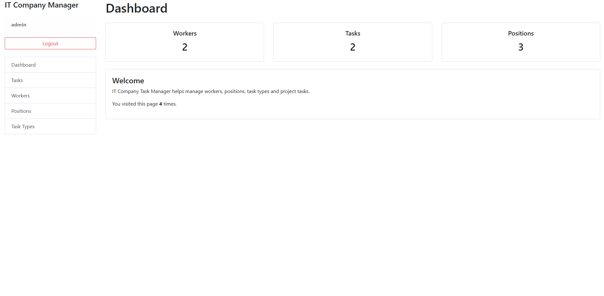
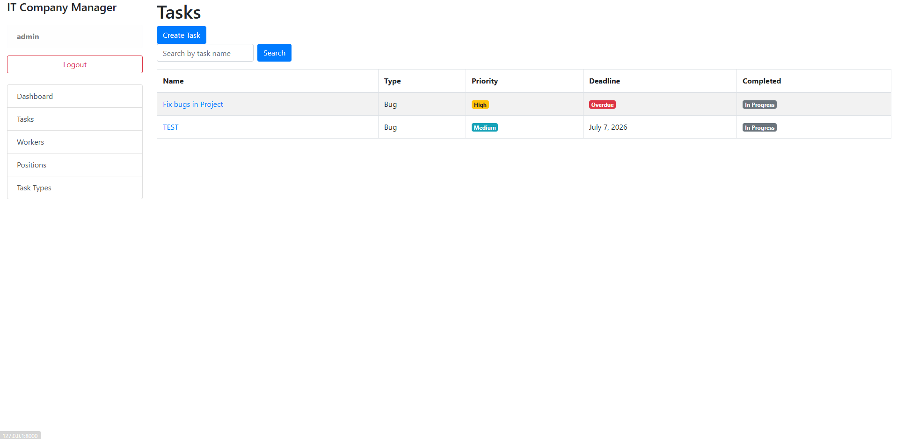
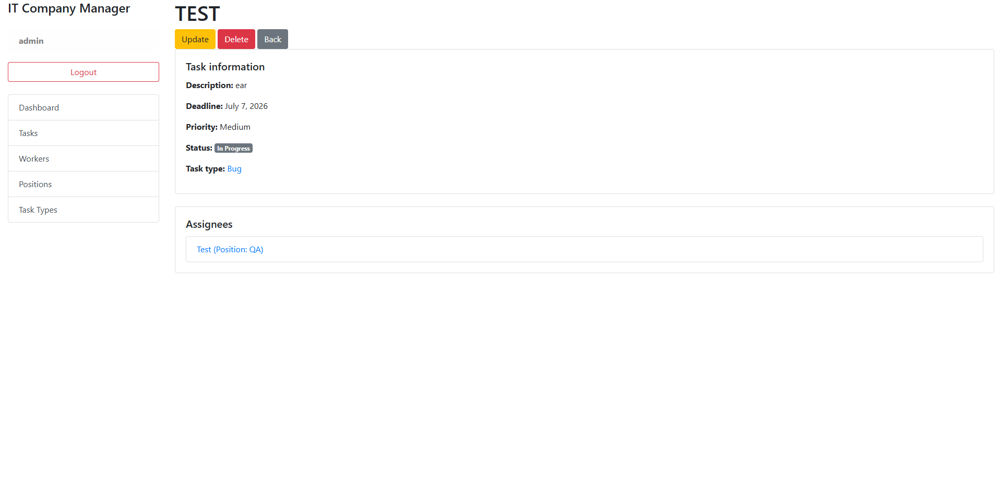
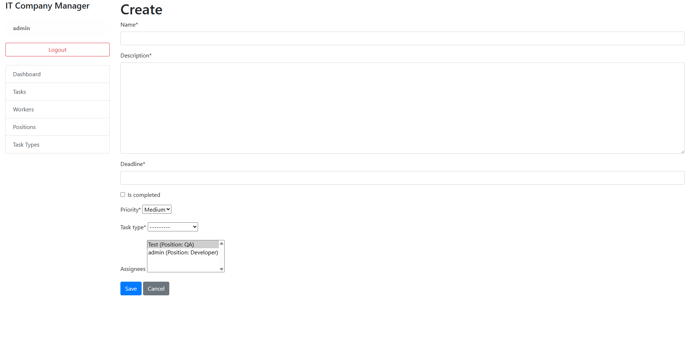
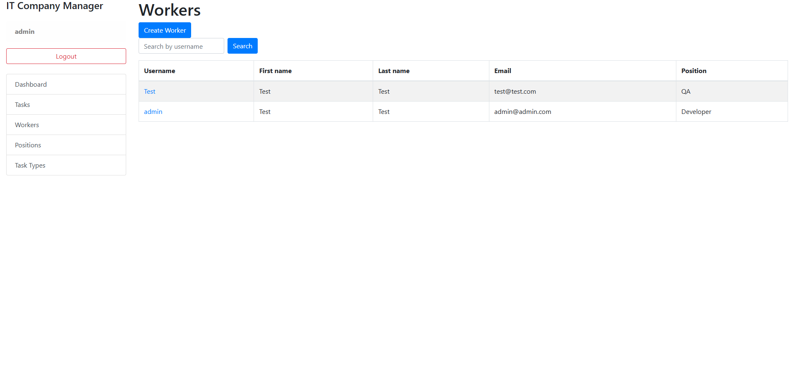
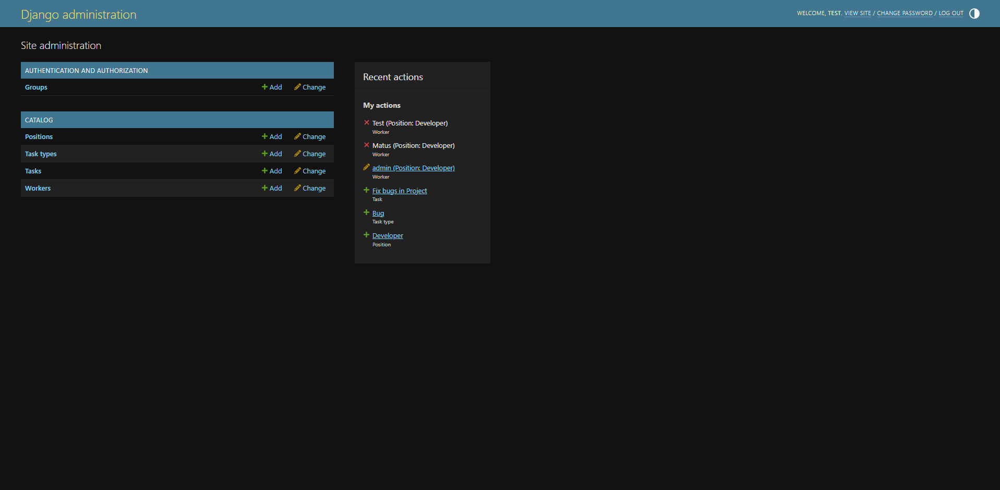

# IT Company Task Manager

Django web application for managing workers, positions, task types, and tasks inside an IT company.

## Demo User

Login: user
Password: user12345

## Features

- User authentication (Login / Logout)
- Custom user model (Worker)
- CRUD operations for:
  - Workers
  - Tasks
  - Positions
  - Task Types
- Task assignment to workers
- Task priority management
- Task deadline validation
- Overdue task detection
- Search functionality
- Pagination
- Django Admin Panel
- Form validation
- Automated tests

## Technologies

- Python 3
- Django
- SQLite
- HTML
- CSS
- Bootstrap
- Crispy Forms

## Database Structure

### Main Models

- Position
- Worker
- TaskType
- Task

### Relationships

- One Position can have many Workers
- One TaskType can have many Tasks
- One Task can have many Workers
- One Worker can have many Tasks

## Installation

Clone the repository:

```bash
git clone https://github.com/matus332/-IT-Company-Task-Manager-.git
cd -IT-Company-Task-Manager-
```

Create and activate virtual environment:

```bash
python -m venv .venv
```

Windows:

```bash
.venv\Scripts\activate
```

Linux / macOS:

```bash
source .venv/bin/activate
```

Install dependencies:

```bash
pip install -r requirements.txt
```

Apply migrations:

```bash
python manage.py migrate
```

Create superuser:

```bash
python manage.py createsuperuser
```

Run development server:

```bash
python manage.py runserver
```

Open in browser:

```text
http://127.0.0.1:8000/
```

## Running Tests

Run all tests:

```bash
python manage.py test
```

## Test Result

```text
Found 19 test(s).
System check identified no issues (0 silenced).

Ran 19 tests

OK
```

## Screenshots

### Dashboard



### Tasks List



### Task Detail



### Create Task



### Workers List



### Admin Panel



## Author

Created as a Django portfolio project.
